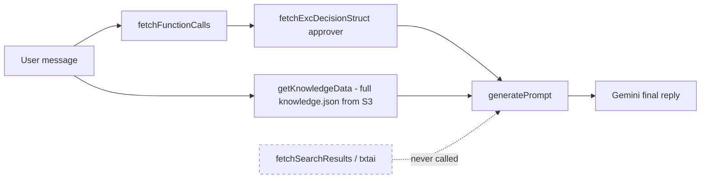

# Refactor Plan — Portfolio-Web Critical Review

Reviewed: 2026-07-05. Scope: bugs, structure, code quality, UI. All findings cite `file:line` in this repo. Type-check (`tsc --noEmit`) passes, so everything below is logic, security, or design level rather than compile errors.

---

## 🔴 Bugs & Security — must fix

### 1. Broken mobile viewport (site-wide UI bug)
- **Location:** `app/layout.tsx:32-34`
- **Problem:** `export const viewport = { width: 1 }` emits `<meta name="viewport" content="width=1">`. A 1px-wide layout viewport forces mobile browsers into extreme scaling; the whole site renders incorrectly on phones.
- **Fix:**
  ```ts
  export const viewport: Viewport = { width: "device-width", initialScale: 1 };
  ```

### 2. Open S3 proxy — anyone can read any bucket object
- **Location:** `app/api/file/route.ts:15-38`
- **Problem:** `GET /api/file?key=<anything>` fetches an arbitrary key (object path) from the bucket with no allowlist or auth, then caches it for a year (`max-age=31536000, immutable`). If the bucket ever holds `master_data.json`, knowledge files, or draft resumes, they are publicly downloadable by guessing keys.
- **Fix:** validate `key` against an allowlist or fixed prefix (e.g. `public/`), reject `../` styles, and drop the immutable cache header for non-versioned keys.

### 3. Chatbot-sent emails likely arrive empty (template param mismatch)
- **Location:** `app/api/sendEmail.ts:55-64` vs `app/api/sendEmail.ts:28-44`
- **Problem:** the two send paths use different template variable names. `sendFormEmail` sends `{ name, email, title, content }` (from form field names); `sendEmail` (the chatbot path) sends `{ sanitizedName, email, sanitizedTitle, sanitizedDescription }` because ES shorthand (object keys taken from variable names) leaked the `sanitized` prefix. One EmailJS template cannot match both; the chatbot path almost certainly produces blank fields.
- **Fix:** `{ name: sanitizedName, title: sanitizedTitle, content: sanitizedDescription, email }`.

### 4. `ShowProjectDemo` function can never fire
- **Location:** `app/lib/chatbot/functionCalls.ts:135-140`
- **Problem:** `ShowProjectDemo` has a handler (`functionHandlers.ts:96`) and a system message (`functionCalls.ts:22-25`) but no declaration in `functionCallList`, so Gemini (the LLM powering the chatbot) is never told this tool exists. Dead feature wired on 2 of 3 required layers.
- **Fix:** add a `showProjectDemoDeclaration` with a `name` enum matching `PROJECT_DEMO_URL_DICT` keys, or delete the handler and dict.

### 5. Reminder default due date is in the past
- **Location:** `app/lib/chatbot/functionHandlers.ts:64`
- **Problem:** `dueDate: args?.dueDate || "2020-10-01"` creates reminders dated 2020 whenever the model omits the date. Also `console.log(args)` debug leftover at line 81.
- **Fix:** default to today (or reject and ask the user), remove the log.

### 6. Logging a Promise instead of the error body
- **Location:** `app/api/reminderApi.ts:69`
- **Problem:** `console.error(response.json())` logs `Promise { <pending> }`; the JSON is never awaited, so delete failures are undiagnosable.
- **Fix:** `console.error(await response.json().catch(() => response.statusText))`.

### 7. Query string built without encoding
- **Location:** `app/api/reminderApi.ts:135-137`
- **Problem:** `Title=${String(val)}` with no `encodeURIComponent`; any title containing `&`, `=`, `#`, or spaces corrupts the request.
- **Fix:** `new URLSearchParams(...)`.

### 8. Gemini timeout does not cancel the request, retries have no backoff
- **Location:** `app/lib/chatbot/geminiService.ts:27-34`, `lib/gemini.ts:75-85`
- **Problem:** the timeout uses `Promise.race` (first settled promise wins), so the losing `fetch` keeps running and consuming quota; retries fire immediately after each 15s timeout with no delay, so a slow upstream triples the load. `lib/gemini.ts` accepts no `AbortSignal` (a handle to cancel an in-flight request).
- **Fix:** thread an `AbortController` from `GeminiService` into the fetch; add exponential backoff between attempts.

### 9. Chat modal fails basic dialog accessibility
- **Location:** `components/Modal/ModalBody.tsx`, `components/ui/AnimatedGlassWindow.tsx`
- **Problem:** no `role="dialog"`, no `aria-modal`, no focus trap (keeping keyboard focus inside the dialog), and no Escape-to-close anywhere in `components/Modal/*` (grep for `Escape`/`focus()` returns nothing). Keyboard and screen-reader users cannot use or exit the chatbot.
- **Fix:** add dialog semantics, Escape handler, focus trap, and return focus to the trigger on close.

### 10. Wrong resume file names in download options
- **Location:** `app/config.ts` (`RESUME_OPTIONS`)
- **Problem:** "AI Engineering" downloads as `zishenchan_SW.pdf` (copy-paste from the SW option), and "General" serves `resume_ai.pdf` as its source file. Users get mislabeled or wrong resumes.
- **Fix:** correct the `filename`/`downloadFilename` pairs.

---

## 🟡 Structure & Tech Debt — should fix

### Dead code (delete or wire up)

| Item | Location | Note |
| --- | --- | --- |
| Search/RAG pipeline | `app/lib/chatbot/fetchSearchResults.ts` | `fetchStructQueryPrompt` and `fetchSearchResults` are only referenced by tests. Production flow never does retrieval. |
| Conversation hook | `app/hooks/useConversation.tsx` | Unused; duplicates the magic number 20 instead of `MAX_CHAT_HISTORY_INSTANCE`, and its trim logic can drop more than the overflow. |
| Scroll hook | `hooks/useScrollToBottom.ts` | Unused; `Modal.tsx` reimplements it inline. |
| Duplicate input | `components/chatbot/ChatbotInput.tsx` | Older copy of `components/Modal/ChatbotInput.tsx`; nothing imports it. |
| Hello endpoint | `app/api/route.ts` | Echo stub, publicly routable. |
| Legacy resume fetcher | `app/lib/chatbot/fetchCustomizedResume.ts` | `fetchResumeData` has no callers (resume now goes through `/api/resume` → external resume-server). It also fetches `getMasterResume()` while receiving `master_data` as a param (double fetch by design confusion). |
| Smoke scripts | `scripts/gemini-smoke-2.ts`, `gemini-smoke-3.ts` | Numbered scratch scripts; move to a `scripts/spikes/` folder or delete. |
| SDK dependency | `package.json` → `@google/genai` | Only tests/scripts import it; production uses the hand-rolled REST client in `lib/gemini.ts`. Pick one: use the SDK everywhere, or drop the dependency and port the two scripts. |

### Documentation drift (docs promise RAG, code dumps everything)

`CLAUDE.md` describes the chatbot flow as "parallel: function call detection + search query synthesis for S3 knowledge retrieval". The actual flow in `fetchReply.ts:38-88` is:



Two consequences: the entire knowledge file is re-downloaded from S3 and stuffed into the prompt on every message (latency + S3 cost + token cost), and the retrieval module rots untested in production. Either re-wire retrieval or delete it and update `CLAUDE.md`/`AGENTS.md`/`GEMINI.md`. Minimum fix: cache `getKnowledgeData()` at module level with a TTL (time-to-live, how long a cached value stays valid).

### Environment variable hygiene

- `TXTAI_BASE_URL` and `NEXT_PUBLIC_GEMINI_MODEL_QUERY` are read via raw `process.env` (`fetchSearchResults.ts:29,74`) and exist in `.env.example`, but are missing from the `app/env/server.ts` / `client.ts` schemas. The whole point of `@t3-oss/env-nextjs` (startup validation of env vars) is defeated when files bypass it, and `lib/s3-file-loader.ts:7-13` also uses raw `process.env` while `app/api/file/route.ts` uses `envServer` for the same credentials.
- All five Gemini model names are `NEXT_PUBLIC_*` (bundled into client JS) yet only ever used in server code. Move them to `envServer` so they are not public and can rotate without a client rebuild.

### Duplication and layout

- Two `cn()` helpers: `app/utils/cn.ts` and `lib/utils.ts` (identical). Keep one.
- Two hooks folders: `app/hooks/` and `hooks/`. Keep one.
- Three config homes: `app/config.ts`, `app/config/api.ts`, `app/lib/chatbot/config.ts`. The chatbot config mixes UI timing constants, prompt config, and error strings, then does `export * from "./prompts"` so imports of "config" silently pull prompts. Split into `config` (values) and keep prompts imported explicitly.
- Naming: the project is called `remainder-api` (folder, `RemainderApi.tsx`, `CompareDetail.tsx` siblings) while everything else says "reminder". If "Remainder" is not an intentional pun, this typo is user-visible in the URL `/projects/remainder-api`.
- Mixed component naming: `FluidGlass.tsx` (PascalCase) beside `floating-navbar.tsx`, `code-block.tsx`, `placeholders-and-vanish-input.tsx` (kebab-case, imported from a UI kit). Pick a convention for `components/ui/`.

### React quality

- All three provider values are rebuilt every render with no `useMemo` (`AppActionsContext.tsx:50-56`, `UIStateContext.tsx:71-79`, `ModalContext.tsx:16-20`), so every consumer re-renders whenever any provider state changes. Wrap values in `useMemo`.
- Copy-paste error message: `useAppActions` throws "useUIState must be used within AppActionsContextProvider" (`AppActionsContext.tsx:68`).
- `ReminderContext.tsx:30-78` ships 5 hardcoded example reminders as initial state and uses stringly-typed reducer actions (`type: string`); use a discriminated union (a TypeScript pattern where the `type` field narrows the payload).
- `ModalFooter.tsx:112-114`: the 30s timeout promise's timer is never cleared after a successful reply, and like the Gemini case the losing fetch is not aborted. `reply.funcSysMsg` can be `undefined` and is cast into `ChatInstance.message` (`:144`).
- `fetchWithRetry.ts:5` returns `response: any`; every caller casts. Make it `fetchWithRetry<T>` and return typed data.
- Empty `else {}` block at `UIStateContext.tsx:37-38`; silently ignoring a missing scroll target deserves at least a dev-mode warning.

### Testing gaps

Unit tests cover the chatbot chain well, but the highest-risk code has none: `app/api/file/route.ts` (security), `app/api/sendEmail.ts` (the param mismatch above would have been caught), `functionHandlers.ts` date defaulting, and `reminderApi.ts` URL building. Add regression tests alongside fixes 2, 3, 5, 6, 7 (CLAUDE.md Fix-mode rule: every bug fix gets a regression test).

---

## 🟢 Style & UI — optional

- `components/Contact/Form.tsx:48`: the "Comments" field is a single-line `<Input type="text">`; use a `<textarea>`. The form also never resets after a successful send and `sendFormEmail` fires without awaiting, so validation of the EmailJS response is toast-only.
- `GEMINI_GENERATION_CONFIG.maxOutputTokens: 1020` (`app/lib/chatbot/config.ts:25`) is an odd cap; 1024 was probably intended.
- Heavy layered effects: `backdrop-blur-3xl` + `AnimatedBlobs` + `GlassSurface` SVG distortion render together in the modal and contact card. Fine on desktop; on mid-range phones (compounded by bug #1) this will drop frames. Consider gating blob animation behind the existing `allowAnimation` flag, which already respects `prefers-reduced-motion` (good work there, `UIStateContext.tsx:57-69`).
- Five project pages carry `TODO: Links section` placeholders (`app/(pages)/projects/*/page.tsx`), matching the "Project Content completion" item in `.ai/assets/progress.md`.
- `components/Landing/Hero/Lamp.tsx:7` is marked for retirement once the Soft Aurora hero is verified; both currently ship in the bundle.
- `demoChatHistory.tsx` bot disclaimers are delivered as fake chat messages in square brackets; a dedicated disclaimer element above the thread would be cleaner and would not pollute the history sent to the model.

---

## Suggested execution order

1. **Hotfixes (small diffs, high impact):** viewport (#1), email params (#3), reminder date (#5), resume filenames (#10), promise logging (#6), URL encoding (#7).
2. **Security:** lock down `/api/file` (#2), delete `app/api/route.ts`, move model names to server env.
3. **Chatbot integrity:** ShowProjectDemo declaration (#4), abortable Gemini client + backoff (#8), knowledge caching, decide RAG-in or RAG-out and update docs.
4. **Cleanup sweep:** delete dead files, merge `cn()`/hooks/config locations, memoize context values, type `fetchWithRetry`.
5. **UI/a11y:** modal dialog semantics (#9), textarea, form reset, effect gating.
6. **Tests:** regression tests for every item in step 1-2.

Each step is independently shippable; steps 1 and 2 should land before anything else.
