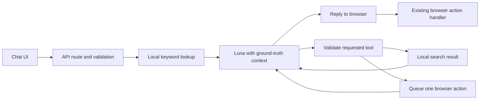

# Portfolio chatbot: one Luna agent with local retrieval

## Decision and scope

Use OpenAI Responses with `gpt-5.6-luna`, authenticated by server-only `OPENAI_API_KEY`. A visitor turn has one agent that can request tools and then continue with their results. There are no detection, approval, query-writing, review, or response-synthesis agents. `OPENAI_MODEL` can override the model on the server; it is not accepted from clients.

This implements the requested Gemini migration, small server-side RAG, single-agent tool workflow, code placement, and removal of old/paid tests. The independent Python resume service remains outside this chatbot migration. Unused TypeScript resume generation and its multi-agent CLI were retired with the Gemini dependency.

## Placement

| Location | Responsibility |
| --- | --- |
| `components/Modal/*`, `components/Chatbot/*` | Existing chat presentation and input |
| `components/PortfolioPreview/*` | Existing preview concierge and browser speech UI |
| `app/lib/chatbot/fetchReplyClient.ts` | Browser HTTP client with aborting timeout |
| `app/lib/chatbot/types.ts`, `config.ts` | Provider-neutral UI contracts and constants |
| `app/lib/chatbot/functionHandlers.ts` | Execute validated browser actions through existing app contexts |
| `app/api/chatbot/route.ts` | Legacy chat HTTP entry point |
| `app/api/concierge/route.ts` | Preview concierge HTTP entry point |
| `lib/chatbot/http.ts` | Body limits, validation, role normalization, deadline, safe errors |
| `lib/chatbot/agent.ts` | Instructions, ground-truth augmentation, bounded single-agent loop |
| `lib/chatbot/openai.ts` | Server credential, Responses transport and response validation |
| `lib/chatbot/tools.ts` | Allowed tool schemas, descriptions, argument validation |
| `lib/chatbot/retrieval.ts` | In-memory keyword index and follow-up topic retrieval |
| `lib/chatbot/knowledge.json` | Small curated, locally bundled corpus |
| `lib/chatbot/__tests__/chatbot.test.ts` | Offline behavior and route tests |

Server modules use `server-only`; no provider SDK, prompt, or corpus is imported into the browser. Route files contain only HTTP entry points. There are no chatbot server actions that bypass request validation.

## Request flow

Legacy `{ chatHistory, enableFunctionCalling }` and concierge `{ messages }` requests keep their response formats. Legacy `bot` roles become `assistant`; UI `system` notices and failed replies are excluded. User-supplied system or developer instructions are never promoted into model instructions.

The concierge exposes local search only because its current UI does not execute legacy actions. The modal exposes navigation, email preparation, and reminder preparation when its action toggle is enabled. The reminders playground calls the same API and checks for an actual reminder result before adding one.

A browser action tool returns `queued_for_browser`, not a success claim. The action is delivered only with a successful final response and executed by the existing browser handler. There is no server-side email/reminder side effect inside the model loop. Tool instructions require explicit visitor intent; argument validation checks enums, email formatting, dates, unknown fields and names. This validates structure, not intent cryptographically; the browser action layer retains its existing trust and authorization model.

## Ground truth and retrieval

The initial corpus is a curated snapshot of the portfolio's existing project descriptions and disclosure notes, with the assistant entry updated for this migration. It deliberately has no runtime dependency on the in-progress preview registry. Maintain `knowledge.json` alongside authored portfolio changes. Each topic carries an ID, title, keywords, source path, and factual content. Keep evidence limitations attached; do not insert private resume records, secrets, or unsupported results. Add verified biography/experience topics here if more detail is needed; the former S3 knowledge file is no longer fetched.

Token matching is case-insensitive and ignores common stop words. Title/keyword matches get more weight than body matches; uncommon terms get more weight than common terms. Search returns up to three topics, or none for an unmatched query. The initial prompt includes the profile and up to three topics. Short follow-ups can use the previous user topic; explicitly named topics take precedence. The agent can call `search_portfolio` for another local lookup. Missing facts must be acknowledged. This is lexical retrieval, so paraphrases and languages absent from the corpus may need additional keywords; no semantic-search quality is implied.

## Cost and failure behavior

- Maximum 20 messages, 2,000 characters each, 48 KB request body.
- Maximum three Responses requests per visitor turn; typically one for a direct answer.
- At most one tool call per response and one queued browser action per turn. The third response disables tools.
- Maximum 800 output tokens per model call, reasoning effort `none`, no automatic retries.
- One 25-second server deadline across the loop; browser chat transport aborts after 30 seconds. Request cancellation propagates to fetch.
- `store: false`, no response caching, and no logging of transcripts, credentials, or provider bodies.
- Invalid input returns 400/413. Provider errors, incomplete/empty replies, or exhausted tool budgets return a generic 503, with no queued action exposed.

These are per-request limits. Public-endpoint deployment still needs platform-level rate/spend controls for aggregate traffic; there is no distributed rate limiter in this change.

## Validation and removal

The replacement suite mocks every network response and covers grounding selection, follow-up retrieval, tool results, disabled/invalid tools, iteration limits, cancellation, route contracts, validation, and provider failures. It makes no paid API calls. Old Gemini unit/integration tests, smoke scripts (including the paid resume API smoke test), golden cases, evaluator fixtures, live-test commands, and live CI jobs are removed. Other UI and utility tests remain.

Official references: [Luna model](https://developers.openai.com/api/docs/models/gpt-5.6-luna), [Responses function calling](https://developers.openai.com/api/docs/guides/function-calling). No live account/model availability check is performed during validation.
